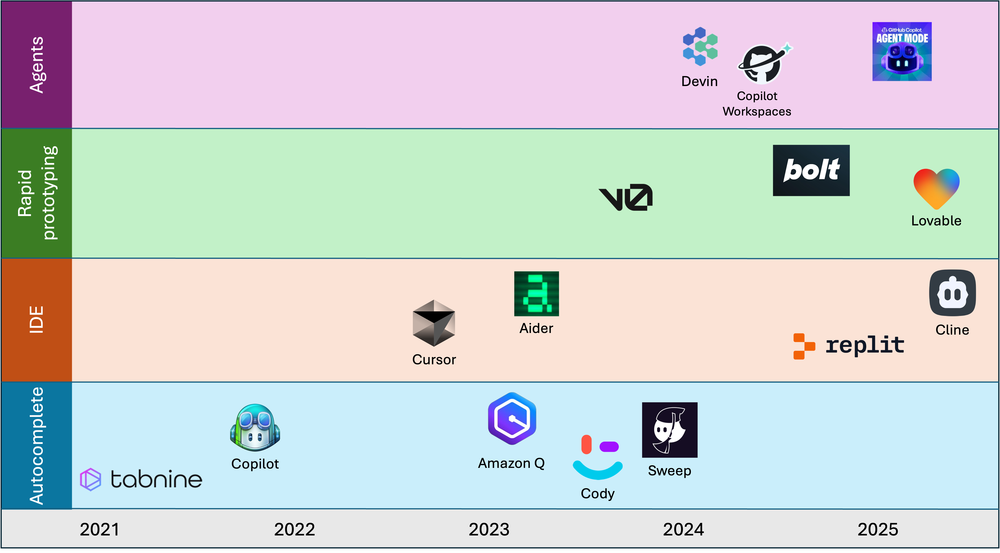

# Awesome AI Developer Tools

A curated list of the more mature AI tools for enhancing developer productivity.

There are a growing number of tools that leverage AI to assist developers write code, refactor, debug and more. These fall into some broad categories, however, there is a lot of overlap, which blurs the boundaries. This *awesome list* isn't intended to exhaustively list every tool, there's already a [really good list for that purpose](https://github.com/jamesmurdza/awesome-ai-devtools). Rather, here we only cover the more mature tools, but importantly provide detail. This will hopefully be a more useful starting point for anyone wanting to compare and select a tool.

<!-- vscode-markdown-toc -->
* [Autocompletion tools](#Autocompletiontools)
	* [GitHub Copilot](#GitHubCopilot)
	* [Amazon Q](#AmazonQ)
	* [Sweep](#Sweep)
	* [Tabnine](#Tabnine)
	* [Cody](#Cody)
* [Integrated Development Environments (IDE)](#IntegratedDevelopmentEnvironmentsIDE)
	* [Replit Agent](#ReplitAgent)
	* [Cursor](#Cursor)
	* [Cline](#Cline)
	* [Windsurf](#Windsurf)
	* [Aider](#Aider)
* [Rapid prototyping](#Rapidprototyping)
	* [v0](#v0)
	* [Bolt](#Bolt)
	* [Lovable](#Lovable)
* [Agents](#Agents)
	* [Devin](#Devin)
	* [Copilot Workspaces](#CopilotWorkspaces)
	* [GitHub Copilot Agent Mode](#GitHubCopilotAgentMode)

<!-- vscode-markdown-toc-config
	numbering=false
	autoSave=true
	/vscode-markdown-toc-config -->
<!-- /vscode-markdown-toc -->

## Autocompletion tools

### GitHub Copilot

| Released   | Cost             | Open source | From   |
|------------|------------------|-------------|--------|
| Oct 2021   | $0-$21 user/mo   | No          | [GitHub](https://github.com/features/copilot) |

GitHub Copilot, introduced in October 2021, marked a significant advancement in AI-assisted software development. Developed by GitHub in partnership with OpenAI, it leverages the Codex model to provide developers with intelligent code suggestions, streamlining the coding process and boosting productivity.

 - **AI-Powered Code Completion** – Provides real-time code suggestions as you type, offering complete lines or entire functions. Supports multiple programming languages, including Python, JavaScript, Java, C++, and more. 
 - **Whole Function and Boilerplate Generation** – Generates entire functions, including complex logic, based on high-level descriptions.  
 - **Copilot Edits for multi-file support** – Iterate quickly on code changes across multiple files by using natural language.  
 - **Code Explanation and Learning** – Helps developers understand existing codebases by providing AI-generated explanations. Useful for debugging, onboarding new team members, and learning new frameworks. 
 - **Multi-Platform and IDE Support** – Works with Visual Studio Code, JetBrains IDEs, and Neovim.

### Amazon Q

| Released   | Cost             | Open source | From   |
|------------|------------------|-------------|--------|
| Nov 2023   | $0-$19 user/mo   | No          | [AWS](https://aws.amazon.com/q/) |

Amazon Q is a generative AI-powered assistant developed by Amazon Web Services (AWS) to enhance software development, data management, and cloud operations. Announced in November 2023 at AWS re:Invent.

- **AI-Powered Code Completions** – Provides real-time code suggestions, including entire lines or full functions, based on the context of the developer’s code and comments. 
- **Multi-Language Support** – Supports various programming languages such as Python, Java, JavaScript, C#, TypeScript, Rust, Go, and more, making it versatile for different development tasks. 
- **IDE Integration** – Works with Visual Studio Code (VS Code), JetBrains IDEs (IntelliJ IDEA, PyCharm, WebStorm), AWS Cloud9, and Jupyter Notebooks, ensuring a smooth workflow within existing development environments. 
- **Context-Aware Code Suggestions** – Analyzes project structure, dependencies, and libraries to generate more relevant and accurate code recommendations. 
- **AWS Service Integration** – Provides optimized code suggestions for AWS services, including Amazon S3, Lambda, DynamoDB, EC2, and others, making it highly useful for cloud-based application development. 
- **Customizability and Enterprise Support** – Offers enterprise features, including customized model training based on an organization's codebase, improving the relevance of AI-generated suggestions for teams. 
- **Reference Tracking and Legal Compliance** – Helps developers identify whether AI-generated code is similar to existing open-source code and provides links to the original source, ensuring compliance with licensing requirements.
- **Autonomous Agents for Complex Tasks** - Amazon Q Developer agents can autonomously perform tasks like implementing features, documenting code, testing, reviewing, and refactoring, thereby streamlining the software development lifecycle.

### Sweep

| Released   | Cost             | Open source | From   |
|------------|------------------|-------------|--------|
| Nov 2023   | $0-$25 user/mo   | No          | [Sweep](https://sweep.dev/) |

Sweep is an AI-powered coding assistant designed to streamline software development by automating tasks such as bug fixes and feature implementations, within the JetBrains IDE.

- **Automated Code Changes** – Sweep transforms bug reports and feature requests into actionable code modifications. By analyzing the codebase, it plans and generates pull requests with the necessary changes, reducing manual intervention.
- **Seamless GitHub Integration** – The platform integrates directly with GitHub repositories, allowing developers to assign issues to Sweep. It reads the codebase, formulates a plan, and submits pull requests, streamlining the development workflow.
- **JetBrains IDE Support** – Sweep offers compatibility with JetBrains IDEs, including IntelliJ, PyCharm, and Android Studio, bringing AI coding assistance directly into these development environments.
- **Multi-Language Support** – The assistant supports various programming languages, enabling it to assist in diverse development projects.
- **Continuous Learning** – Leveraging advanced language models, Sweep continually improves its understanding of codebases and development practices, enhancing the accuracy and relevance of its code suggestions over time.

### Tabnine

| Released   | Cost             | Open source | From   |
|------------|------------------|-------------|--------|
| 2019   | $9-$39 user/mo   | No          | [Tabnine](https://www.tabnine.com/) |

Tabnine is an AI-powered code completion tool designed to assist developers by providing intelligent code suggestions and autocompletions. It enhances productivity by integrating seamlessly with various IDEs and supporting multiple programming languages. Its core functions and capabilities include:

- **AI-Driven Code Completion** – Provides context-aware autocompletions, suggesting entire lines or blocks of code based on the user’s coding patterns and project context.
- **Multi-Language Support** – Works with a wide range of programming languages, including Python, JavaScript, Java, C++, Go, and more, making it useful for diverse development environments.
- **Seamless IDE Integration** – Compatible with popular IDEs such as VS Code, JetBrains suite (IntelliJ, PyCharm, WebStorm), Vim, Sublime Text, and others, allowing developers to use it within their preferred environment.
- **Private and Secure AI Models** – Offers on-device AI models that ensure user code remains private. Developers can run Tabnine locally without sending code to external servers, improving security and compliance.
- **Custom AI Model Training** – Allows teams and enterprises to fine-tune AI models based on their specific codebases, making the suggestions more relevant to their projects.
- **Contextual Awareness** – Analyzes project structure, function definitions, and dependencies to generate more relevant code suggestions, improving efficiency in large codebases.
- **Team and Enterprise Features** – Provides centralized AI model management for organizations, ensuring consistent code quality across teams.
- **Pair Programming Assistance** – Acts as a virtual pair programmer, reducing cognitive load by generating boilerplate code, common patterns, and refactoring suggestions.

### Cody

| Released   | Cost             | Open source | From   |
|------------|------------------|-------------|--------|
| 2023   | $0-$59 user/mo   | No          | [Sourcegraph](https://sourcegraph.com/) |

Sourcegraph, launched in 2013, is a code search and intelligence platform designed to help developers navigate and understand large codebases efficiently. In 2023 they added Cody, an AI-autocompletion service.

- **AI-Powered Code Autocompletion** – Provides real-time, intelligent code suggestions, completing entire lines or functions based on project context.
- **Multi-Language Support** – Works with various programming languages, including Python, JavaScript, Go, Java, C++, Rust, and more.
- **Context-Aware Code Assistance** – Unlike traditional code assistants, Cody has deep knowledge of an entire codebase, enabling it to provide relevant suggestions, identify dependencies, and navigate large projects.
- **IDE and Editor Integration** – Supports VS Code, JetBrains IDEs, Neovim, and Sourcegraph’s own web-based environment, ensuring smooth integration with developers' workflows.
- **Code Search and Understanding** – Allows developers to quickly search and navigate through large codebases, helping them understand unfamiliar code more efficiently.
- **Code Explanation and Documentation** – Can generate explanations for code snippets, making it easier to onboard new developers or understand complex legacy code.
- **Refactoring and Code Improvements** – Suggests optimizations, helps rewrite inefficient code, and improves maintainability through structured refactoring.
- **Repository-Wide AI Assistance** – Unlike AI models that focus only on open files, Cody analyzes the entire repository, making its suggestions more contextually relevant.
- **Chat-Based AI Assistance** – Developers can chat with Cody using natural language queries, asking it to find specific code, explain logic, or even generate new functions.
- **Security and Privacy** – Offers on-premises and self-hosted deployment options, ensuring code remains private and secure, particularly for enterprise teams.
- **Enterprise Features and Custom Models** – Provides enterprise-grade AI assistance tailored to company-specific repositories and coding practices.

## Integrated Development Environments (IDE)

### Replit Agent

| Released   | Cost             | Open source | From   |
|------------|------------------|-------------|--------|
| Sept 2024   | $0-$20 user/mo   | No          | [Replit](https://replit.com/ai) |

Replit is a cloud-based integrated development environment (IDE) that simplifies coding, collaboration, and application deployment directly from the browser. Founded in 2016, Replit introduced Replit Agent in 2024 to provide AI-powered assistance for developers.

- **AI Assistance** – Replit integrates AI tools, such as Replit Agent, to assist with code generation, debugging, and intelligent code completions, helping developers work more efficiently.
- **Multilingual Support** – The platform supports over 50 programming languages, including Python, JavaScript, C++, and Java, enabling developers to work in their preferred language.
- **Real-Time Collaboration** – Replit's collaborative features allow multiple users to code together in real-time, with tools like live coding sessions, shared environments, and built-in chat.
- **Instant Deployment** – Users can deploy applications directly from the Replit environment with minimal setup, supporting rapid testing and production releases.
- **Integrated Development Environment** – As a cloud-based IDE, Replit provides tools like code editors, debuggers, and version control systems, accessible from any device with internet access.
- **Community and Learning Resources** – Replit offers a community where users can share projects, seek help, and access educational resources, supporting learning and collaboration among developers.

### Cursor

| Released   | Cost             | Open source | From   |
|------------|------------------|-------------|--------|
| Oct 2023   | $0-$40 user/mo   | No          | [Anysphere](https://www.cursor.com/) |

Cursor is an AI-powered integrated development environment (IDE) developed by Anysphere Inc, designed to enhance developer productivity by integrating advanced artificial intelligence features directly into the coding environment. It is a fork of the widely used VSCode platform.

- **AI-Powered Code Generation** – Allows developers to write code using natural language instructions, enabling the generation or updating of entire classes or functions, streamlining the coding process.
- **Intelligent Autocompletion** – Predicts subsequent code edits, allowing users to navigate through changes efficiently and facilitating rapid development by anticipating the developer's needs.
- **Codebase Understanding** – Comprehends and provides insights into the entire codebase, allowing developers to query the codebase in natural language to retrieve information or refer to specific files and documentation, enhancing code comprehension and navigation.
- **Smart Rewrites** – Offers capabilities to update multiple lines of code simultaneously, which is particularly useful for refactoring and implementing bulk changes efficiently.
- **Extension Compatibility** – As a fork of Visual Studio Code, Cursor supports the integration of existing extensions, themes, and keybindings, ensuring that developers can maintain their preferred workflows without disruption.
- **Privacy and Security** – Offers privacy options, including a Privacy Mode where the user's code is never stored remotely, and is SOC 2 certified, ensuring adherence to industry-standard security practices.

### Cline

| Released   | Cost             | Open source | From   |
|------------|------------------|-------------|--------|
| Jan 2025   | token-based   | Yes          | [Cline](https://cline.bot/) |

Cline is an open-source AI coding assistant designed to enhance developer productivity by integrating seamlessly with Visual Studio Code (VS Code) and command-line interfaces (CLI). 

- **Dual Execution Modes** – Operates in 'Plan' mode to outline a structured approach before tasks and 'Act' mode to execute tasks directly, streamlining development.
- **Terminal Command Execution** – Executes terminal commands within VS Code, enabling tasks like installing dependencies, running scripts, or starting servers directly from the editor.
- **Model Context Protocol (MCP)** – Extends capabilities through plugins, allowing interaction with databases, live documentation, and automation of diverse tasks.
- **File Operations** – Manages project files by creating, editing, searching, and replacing text across files, simplifying file management tasks.
- **Code Analysis and Debugging** – Identifies issues, refactors code, and adds documentation, improving code quality with insights and suggestions.
- **Integration with Multiple AI Models** – Supports various AI models like Anthropic's Claude, OpenAI's GPT series, and Google's Gemini, offering flexibility for project needs.
- **Browser Interaction** – Launches sites in a headless browser, performs actions like clicking and typing, and captures screenshots and logs for testing and debugging.
- **Community-Driven Development** – Encourages contributions from the open-source community, ensuring continuous improvement and new feature additions.

### Windsurf

| Released   | Cost             | Open source | From   |
|------------|------------------|-------------|--------|
| Nov 2024   | $0-$90 user/mo   | No          | [Windsurf](https://codeium.com/windsurf) |

Windsurf is an open-source AI tool designed to enhance collaboration and productivity in software development. Its core features include:

- **AI Collaboration** – Combines AI assistants and agents to collaboratively handle complex tasks with developers.
- **Cascade Functionality** – Monitors developer actions in real-time, offering context-aware suggestions, command execution, and debugging support.
- **Multi-File Editing** – Simplifies managing multiple files with context-aware and tool-integrated approaches.
- **Natural Language Commands** – Supports natural language input in the editor and terminal to improve development efficiency.
- **Real-Time Collaboration** – Enables multiple developers to work on the same project simultaneously, boosting productivity and reducing delays.
- **VS Code Plugin Compatibility** – Works with the VS Code plugin marketplace, allowing integration of tools like linters, debuggers, and themes.

### Aider

| Released   | Cost             | Open source | From   |
|------------|------------------|-------------|--------|
| May 2023   | free   | Yes         | [Aider](https://aider.dev/) |

Aider is an open-source AI-powered pair programming tool that integrates directly into your terminal. It isn't really an IDE

- **AI Pair Programming** – Facilitates real-time collaboration with AI, enabling developers to add features, fix bugs, refactor code, and update documentation using natural language interactions.
- **Seamless Git Integration** – Integrates with local Git repositories, automatically committing changes with meaningful messages to ensure version control and traceability.
- **Multi-File Editing** – Supports simultaneous editing of multiple files, allowing complex modifications across various parts of a project.
- **Broad Language Support** – Compatible with programming languages like Python, JavaScript, TypeScript, PHP, HTML, and CSS, making it versatile for diverse development needs.
- **LLM Compatibility** – Connects to various LLMs, including Claude 3.5 Sonnet, DeepSeek V3, GPT-4o, and local models, offering flexibility in AI model selection.
- **Real-Time IDE Integration** – Works within preferred editors or IDEs, ensuring real-time updates and a seamless coding experience.
- **Enhanced Interaction Features** – Supports adding images, URLs, and voice commands to chat interactions, enriching communication with the AI assistant.
- **Efficient Large Codebase Handling** – Utilizes repository mapping to handle large codebases effectively, ensuring context-aware assistance and efficient navigation.

## Rapid prototyping

### v0

| Released   | Cost             | Open source | From   |
|------------|------------------|-------------|--------|
| Oct 2023   | $0-$200 user/mo   | No          | [Vercel](https://v0.dev/) |

v0.dev is an AI-powered UI development tool developed by Vercel that simplifies the process of creating web interfaces. 

- **AI-Driven UI Generation** – Generates React code from natural language descriptions, enabling rapid prototyping and development.
- **Code Execution** – Allows users to write and execute JavaScript and Python code directly within the platform for quick testing and iteration.
- **Framework Compatibility** – Supports integration with frameworks like React, Vue, Svelte, Tailwind CSS, and shadcn/ui, ensuring flexibility for various projects.
- **Project Organization** – Helps manage development by organizing chats into projects, improving collaboration and workflow.
- **Accessibility and Security** – Encourages testing for accessibility and security compliance in generated code to maintain best practices.

### Bolt

| Released   | Cost             | Open source | From   |
|------------|------------------|-------------|--------|
| Oct 2024   | $0-$200 user/mo   | No          | [Bolt](https://bolt.new/) |

Bolt.new is an AI-powered web development platform that enables users to create, edit, and deploy full-stack web applications directly from their browser. Its core features include:

- **AI-Driven Code Generation** – Generates codebases from natural language descriptions, supporting frameworks like React, Vue and Next.js.
- **In-Browser Development Environment** – Uses StackBlitz's WebContainers to provide a full development environment in the browser, allowing npm package installation, Node.js servers, and API interactions without local setup.
- **Real-Time Code Editing** – Lets users manually edit AI-generated code in a browser-based IDE for customization and refinement.
- **Seamless Deployment** – Integrates with platforms like Netlify and Cloudflare for one-click application deployment to production.
- **Collaboration and Version Control** – Supports real-time collaboration and integrates with GitHub for version control, enhancing team workflows.

### Lovable

| Released   | Cost             | Open source | From   |
|------------|------------------|-------------|--------|
| Jan 2025   | $0-$100 user/mo   | No          | [Lovable](https://lovable.dev/) |

Lovable.dev is an AI-powered platform designed to simplify and accelerate web application development. Its core features include:

- **Natural Language to Application** – Converts plain English descriptions into fully functional applications, handling both front-end and back-end development.
- **Instant Prototyping** – Enables rapid prototyping, allowing users to iterate and validate ideas quickly, launching full products in less than a day.
- **AI-Assisted Code Generation** – Automates coding by generating layouts and UI components, reducing the need for extensive coding knowledge.
- **Real-Time Collaboration** – Supports live rendering, instant undo, and collaborative branching, enabling seamless teamwork on the same project.

## Agents

### Devin

| Released   | Cost             | Open source | From   |
|------------|------------------|-------------|--------|
| March 2024   | $500 team/mo   | No          | [Cognition](https://devin.ai/) |

Devin is an AI-powered software engineer developed by Cognition Labs, designed to autonomously handle various aspects of software development. Its core functions and capabilities include:

- **Autonomous Code Generation**: Devin can independently write high-quality, structured code across multiple programming languages, enabling rapid development of applications.
- **Automated Debugging and Testing**: It identifies and fixes bugs within codebases, and generates unit tests to ensure code reliability and performance.
- **End-to-End Project Development**: Capable of planning, coding, and deploying applications from scratch, Devin manages the entire software development lifecycle autonomously.
- **AI Model Training and Fine-Tuning**: Devin assists in training and fine-tuning AI models, facilitating the development of customized machine learning solutions. 
- **Continuous Learning and Adaptation**: It learns from its experiences and user feedback, improving its performance and adapting to new technologies over time. 

### Copilot Workspaces

| Released   | Cost             | Open source | From   |
|------------|------------------|-------------|--------|
| March 2024   | $0-$21 user/mo   | No          | [GitHub](https://githubnext.com/projects/copilot-workspace) |

GitHub Copilot Workspace is an AI-enhanced development environment designed to streamline the software development process. Its core features include:

- **Natural Language Task Initiation** – Developers can start tasks by opening a GitHub issue and clicking "Open in Workspace," preloading the session with issue details for iterative planning and implementation.
- **AI-Generated Development Plans** – Analyzes the codebase and issue context to propose step-by-step plans in natural language, making them easy to understand and modify.
- **Editable AI Proposals** – All AI-generated suggestions and plans are fully editable, allowing developers to tailor content to project requirements and coding standards.
- **Integrated Code Execution** – Enables developers to execute code, validate changes, and test implementations directly within the workspace for a seamless development cycle.
- **Collaborative Sharing** – Allows sharing workspace sessions via links, enabling team members to view progress, provide feedback, and collaborate effectively.

### GitHub Copilot Agent Mode

| Released   | Cost             | Open source | From   |
|------------|------------------|-------------|--------|
| Feb 2025   | preview   | No          | [GitHub](https://github.blog/news-insights/product-news/github-copilot-the-agent-awakens/) |

GitHub Copilot's **Agent Mode** is an advanced feature designed to enhance developer productivity by enabling autonomous execution of complex coding tasks. 

- **Autonomous Task Execution**: In Agent Mode, Copilot can independently perform multi-step coding tasks based on user prompts. It analyzes the codebase, determines necessary modifications, and implements changes across relevant files without continuous user input.
- **Error Detection and Self-Healing**: The agent proactively identifies errors during code execution, such as compile or lint issues, and autonomously rectifies them, ensuring smoother development workflows. 
- **Terminal Command Suggestions**: Copilot recommends and can execute terminal commands essential for tasks like installing dependencies, running tests, or deploying applications, thereby automating routine command-line operations. 
- **Iterative Code Refinement**: The agent iterates over its outputs, refining code implementations until the desired functionality is achieved, reducing the need for manual revisions.
- **Integration with Visual Studio Code**: Currently available in preview for Visual Studio Code, Agent Mode integrates seamlessly into the development environment, allowing developers to leverage its capabilities within their existing workflows.